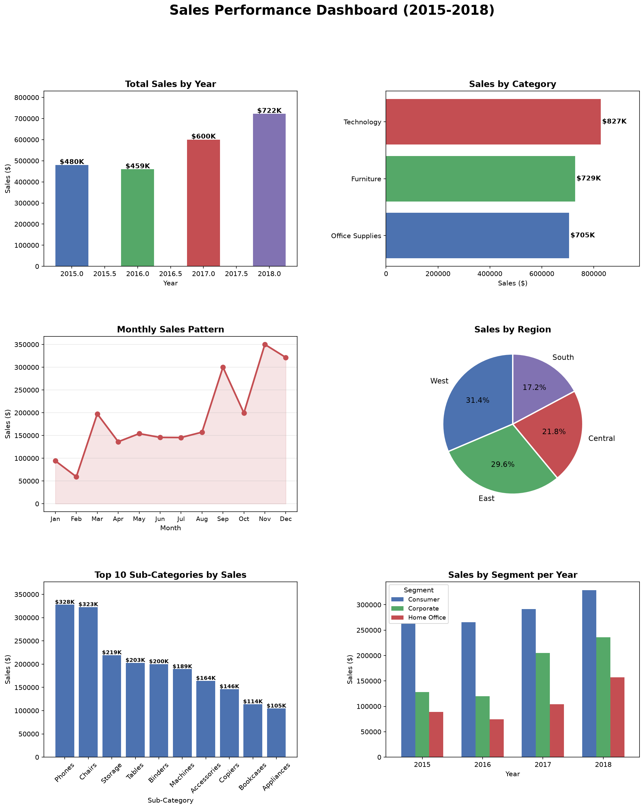

# Sales Performance Dashboard (2015-2018)

## Project Overview
Analyzed 9,800+ retail sales transactions across 4 years to uncover revenue trends,
top-performing categories, regional patterns, and seasonal demand shifts.

## Key Insights
- Sales grew 50.5% from 2015 to 2018, peaking at $722K in 2018
- Technology is the top revenue category contributing 36.6% of total sales
- West region leads with 31.4% of all revenue
- November is the peak sales month ($350K) -- driven by holiday demand
- Phones is the #1 sub-category with $327K in sales
- Consumer segment accounts for 50.8% of total revenue

## Tools Used
- Python (Pandas, Matplotlib, Seaborn)
- Jupyter Notebook
- Dataset: Superstore Sales (Kaggle)

## Dashboard Preview

## Files
| File | Description |
|------|-------------|
| sales.ipynb | Main analysis notebook |
| train.csv | Raw dataset |
| sales_dashboard.png | Final dashboard visualization |

## How to Run
pip install pandas matplotlib seaborn
jupyter notebook sales.ipynb
